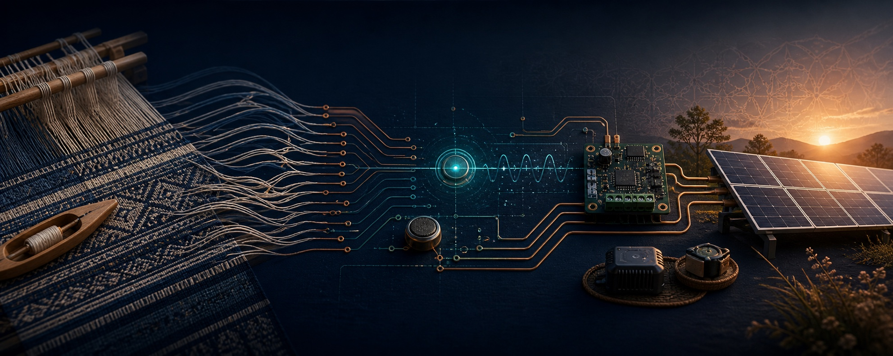

  

<h1 align="center">Sreekar Seera</h1>

  <strong>I turn human problems into safe, measured, working systems.</strong>

  Grade 12 engineering student exploring embedded sensing, feedback control, 
  energy systems and responsible edge AI.

  <code>SENSE</code>&nbsp; → &nbsp;<code>MEASURE</code>&nbsp; → &nbsp;<code>BUILD</code>&nbsp; → &nbsp;<code>TEST</code>&nbsp; → &nbsp;<code>LEARN</code>

 

## Four threads. One direction.

<table>
  <tr>
    <td width="50%" valign="top">
      01 / ARTISAN COMMERCE
      <h3>Kindred Hands</h3>
      
An e-commerce initiative connecting Indian weavers and handicraft producers more directly with customers.

      
<code>PRIVATE DEVELOPMENT</code>

    </td>
    <td width="50%" valign="top">
      02 / EMBEDDED CONTROL
      <h3>LoomLoop</h3>
      
Exploring low-voltage sensing and feedback for yarn-tension variation and loom diagnostics.

      
<code>REQUIREMENTS STAGE</code>

    </td>
  </tr>
  <tr>
    <td width="50%" valign="top">
      03 / RESPONSIBLE AI
      <h3><a href="https://github.com/sreekarseera/baitwatch">BaitWatch ↗</a></h3>
      
Local-first scam detection with reproducible benchmarks, privacy controls and documented limitations.

      
<code>PUBLIC + TESTED</code>

    </td>
    <td width="50%" valign="top">
      04 / ENERGY ENGINEERING
      <h3>Solar</h3>
      
Technical procurement analysis and documentation review for a 6 MW rooftop-solar project.

      
<code>CASE STUDY PLANNED</code>

    </td>
  </tr>
</table>

 

> **Build only what can be explained. Measure before claiming. Publish limits
> alongside results.**

<strong>My engineering practice</strong>

 

I begin with the user, requirements, constraints and risks. Then I build the
smallest safe prototype, calibrate it against references, test failures and edge
cases, and revise from evidence. LoomLoop remains at requirements stage: no
prototype or field result is claimed yet.

<strong>Tools and learning</strong>

 

**Hardware:** ESP32, Arduino, sensors, ADCs, motor drivers and data logging  
**Code:** C/C++, Python, JavaScript/TypeScript and Git  
**Learning:** instrumentation, signals, control, power electronics and embedded ML

<strong>Responsible AI note</strong>

 

AI may assist research, debugging and documentation. Architecture, component
choices, implementation, testing and every published claim remain my
responsibility. AI-assisted work is disclosed with its verification method and
limitations. The header is AI-assisted illustrative artwork—not project
evidence.

 

  <em>Building affordable, dependable and human-centered technology.</em>

